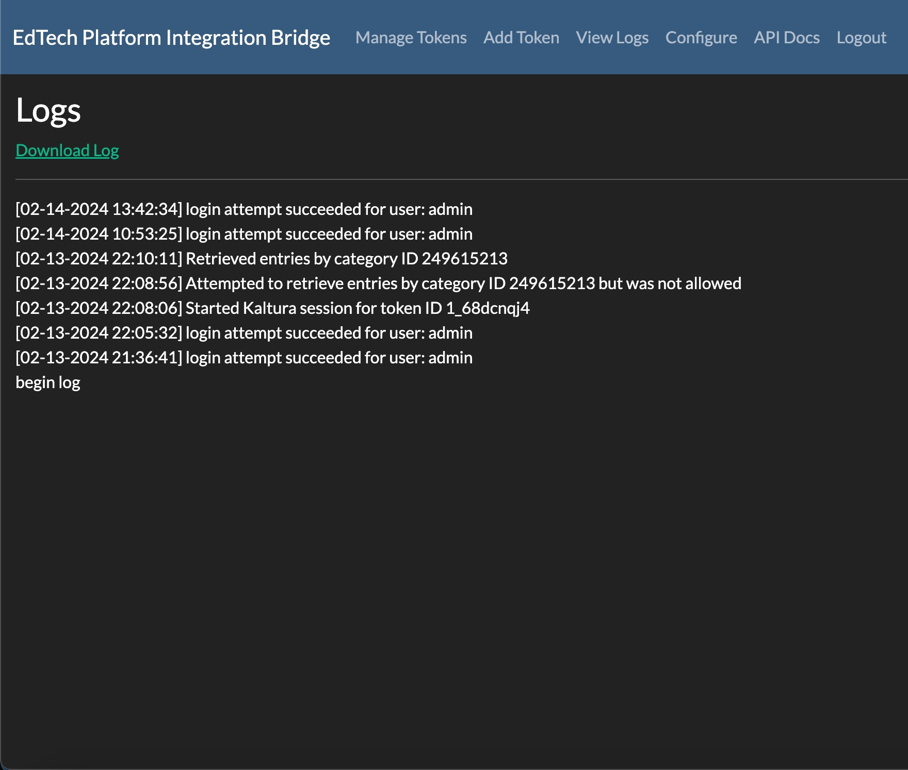

.. _admin-docs-ref:

Administration
==============

Front-end administration docs

Authentication
--------------

Once the application has been deployed, an administrator can access the interface at the root of the domain.
Login with the default credentials to get started.

.. figure:: img/loginpage.jpg
   :alt: Login Page
   :align: center
   
   Login Page

The application currently uses basic authentication but can be adapted for use with SSO, OAuth2, or LDAP.
Clicking on "Remember Me" will place a tamper-proof cookie in the user's local browser storage.

Passwords are hashed and salted when stored in the database.

Add Token
---------

The **Add Token** page is where administrators can add App Tokens that they've generated for third party integrators to use
for accessing the Kaltura APIs. The App Token Id and App Token are required. Entering a label is optional.

.. figure:: img/addtoken1.jpg
   :alt: Add Token Page
   :align: center

   Add Token

Labels
^^^^^^

A label can be used as an additional identifier for an app token and makes storage of the app token more useful.
Currently, labels can be forced for use on the configuration page of the integration bridge.
If labels aren't being forced, they should still be used as an additional identifier for admins to use when tracking many
app tokens.

See the configuration page documentation for more information about forcing label usage.
Future use for labels to be introduced:

* Requiring the use of labels will help to obfuscate tokens completely if used with a special key. This eliminates the need to pass
  around tokens and ids altogether.
* Labels will help to provide meaningful information in logs.

Pull Additional Token Info Checkbox
^^^^^^^^^^^^^^^^^^^^^^^^^^^^^^^^^^^

This is optional but will allow an admin to pull more information from Kaltura when adding a token to the integration bridge.
A Kaltura admin will need to generate a Kaltura Session token (KS) and populate the provided
text box before submission of the token.

   Kaltura Session Token Entry

If the box is checked and no KS is provided (or if the box isn't selected at all), the token will be added to the management list / database,
without the following additional information:

* Assigned Privileges (if any)
* Expiration Date and Time
* Session Duration
* Session User ID (if any)
* Description (if any) - Can be added by an admin when creating a Kaltura App Token

Once the token has been added, it will show in the list on the Manage Tokens page.

Manage Tokens
-------------

   Manage Tokens Page

The Manage Tokens page contains a list of tokens that have been submitted to the database by an administrator,
through the Add Token page. The Integration Bridge does not currently maintain an active connection to any given
system (e.g. Kaltura). The primary functionality of this page, as it stands, is used for keeping tokens organized.

Current functionality:

* View a list of all tokens currently in the database and the system to which they belong.
* View the description provided when the token was generated.
* View any notes created by administrators about each token and any labels applied.
* View token details and expiration notifications.

Future functionality:

* Ability to edit and pull additional info from a source system.
* Fully delete a token.
* Add Tokens for more EdTech systems. Currently only Kaltura is supported.

View More Info
^^^^^^^^^^^^^^

   Manage Token Expanded View

Clicking on "More..." within a token's card will expand the details view for a specific token. Any current labels assigned
to a token can be viewed here in addition to any info populated from the source system when the token was added.

Logs Page
---------

   View Logs Page

Events are logged on this page. Logs are stored in local UTF-8 format and are downloadable in a single file download.

Future functionality:
* An API endpoint will be provided, tied to log retrieval, for use by internal log aggregation, montioring, and data analysis systems.

Logged Events:
* Endpoint successes and failures.
* IDs of data retrieved.
* Sesson Token ID used.
* If a new session was created or reused for subsequent API methods (GET, POST, etc)
* Interface Bridge Logins -- user id and role ('developer' coming soon).
* Locked endpoint usage -- logs user namd and success / failure.
* Kaltura-only: Category blocks: "attempted by not allowed".